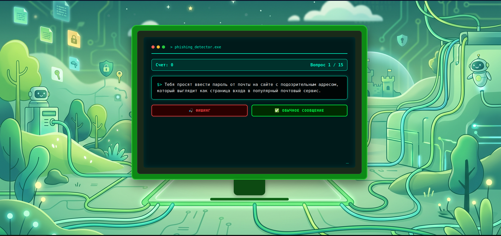

# Phishing detector

Интерактивное веб-приложение для обучения основам кибербезопасности, в частности распознаванию фишинга. Приложение показывает примеры подозрительных сообщений и страниц, а пользователи получают обратную связь о своих ответах.

## 🚀 Запуск приложения

### 📋 Требования

- Python 3.12
- pip

**Для запуска с Docker:**
- Docker установлен (`docker --version`)

---

## Запуск

### 1. Клонировать репозиторий

```bash
git clone https://github.com/kybik0606/kiber_vitya_app
cd kiber_vitya_app
```
### 2. Создать виртуальное окружение

- Linux\macOS:

```bash
python3 -m venv venv
source venv/bin/activate
```

- Windows:

```bash
python -m venv venv
venv\Scripts\activate
```

### 3. Установить зависимости

```bash
pip install -r requirements.txt
```

### 4. Запустить приложение

```bash
python app.py
```

### 5. Открыть в браузере

http://localhost:5000

### Остановить
Нажать **Ctrl+C**

---

## Запуск с Docker

### 1. Клонировать репозиторий

```bash
git clone https://github.com/kybik0606/kiber_vitya_app
cd kiber_vitya_app
```

### 2. Собрать образ

```bash
docker build -t kiber_vitya_app .
```

### 3. Запустить контейнер

```bash
docker run -d -p 8080:5000 --name kiber_app kiber_vitya_app
```

### 4. Открыть в браузере

http://localhost:8080

### 5. Остановить приложение

```bash
docker stop kiber_app
```

### 6. Запустить снова

```bash
docker start kiber_app
```

### 7. Сохранять результаты (чтобы данные не терялись)

```bash
docker run -d -p 8080:5000 -v $(pwd)/results:/app/results --name kiber_app kiber_vitya_app
```

---

## 📸 Скриншоты

| Главная страница | Результаты викторины |
|----------------|----------------|
|  |  |